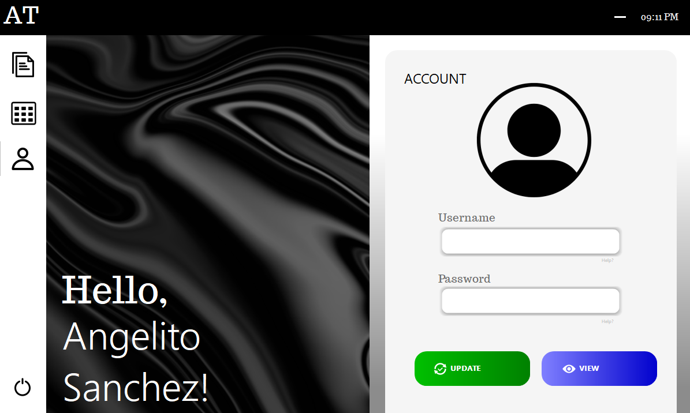
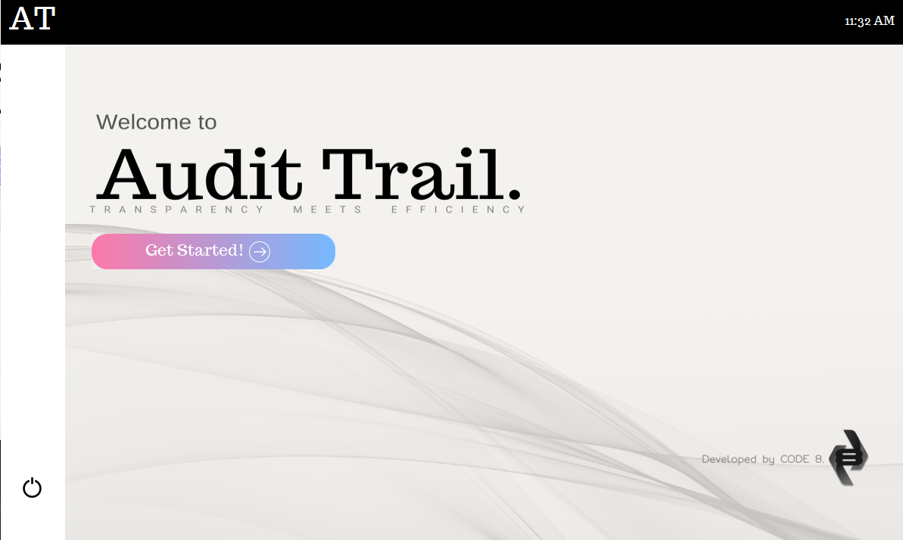

# AuditTrail
AuditTrail is a project developed as part of a Database Management Systems course during the second semester of the user's second year. This project integrates MySQL as the database management system and Visual Basic as the front-end application to provide a comprehensive expense tracking solution.
    
The primary objective of AuditTrail is to assist Angelito Sanchez, a foreman on a construction site, in managing and monitoring financial transactions efficiently. Given the dynamic nature of construction work, where multiple expenses such as labor wages, material procurement, and operational costs are incurred daily, AuditTrail aims to streamline record-keeping and ensure accurate financial oversight. 

   
    Key features of AuditTrail include:  
    
    - Expense Logging: Users can record expenses with details such as amount, category, date, and description. 
    
    - Database Integration: MySQL serves as the backbone, securely storing all financial records for easy retrieval and analysis. 
    
    - Report Generation: The system can generate summaries and detailed reports to help Angelito Sanchez track spending patterns. 
    
    - User-Friendly Interface: Built with Visual Basic, the application ensures ease of use for non-technical users while maintaining robust functionality. 
    
    - Data Security: Secure authentication and access control mechanisms protect financial data from unauthorized modifications. 

    The AuditTrail project was developed by a dedicated team with specific roles:
    
    Charles Larr Sanchez: Responsible for designing the GUI frontend and managing the MySQL backend.
    Devora Tadeo: Focused on documentation, ensuring all system details and processes are well-documented.
    Leimrei Starosa: Handled both documentation and quality assurance, ensuring the system meets required standards.
    Joaquin Manalo: Worked on the MySQL backend, managing data storage and retrieval efficiently.
    
    This collaborative effort ensured that AuditTrail became a reliable and well-structured expense tracking system tailored for its intended user, Angelito Sanchez.

Here are a few snaps of the application.

    
